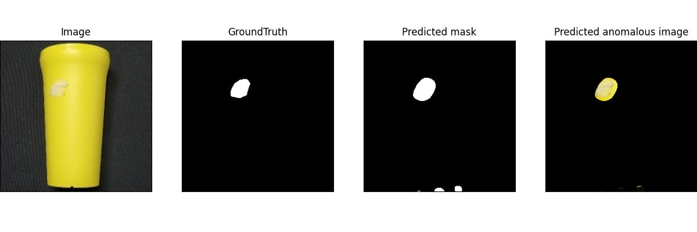

# SPADE cup 

This code is originally written by : [Industrial KNN-BASED Anomaly Detection](https://github.com/rvorias/ind_knn_ad)

🌟 SPADE 🌟

Original paper : [Sub-Image Anomaly Detection with Deep Pyramid Correspondences](https://arxiv.org/abs/2005.02357)

This repo uses cup data to classify contaminated images by SPADE method.

 

### Data
|
normal cup|
contaminated cup|
|--|--|
|||

 

### Result

|
Result|
|--|
||
||
||

